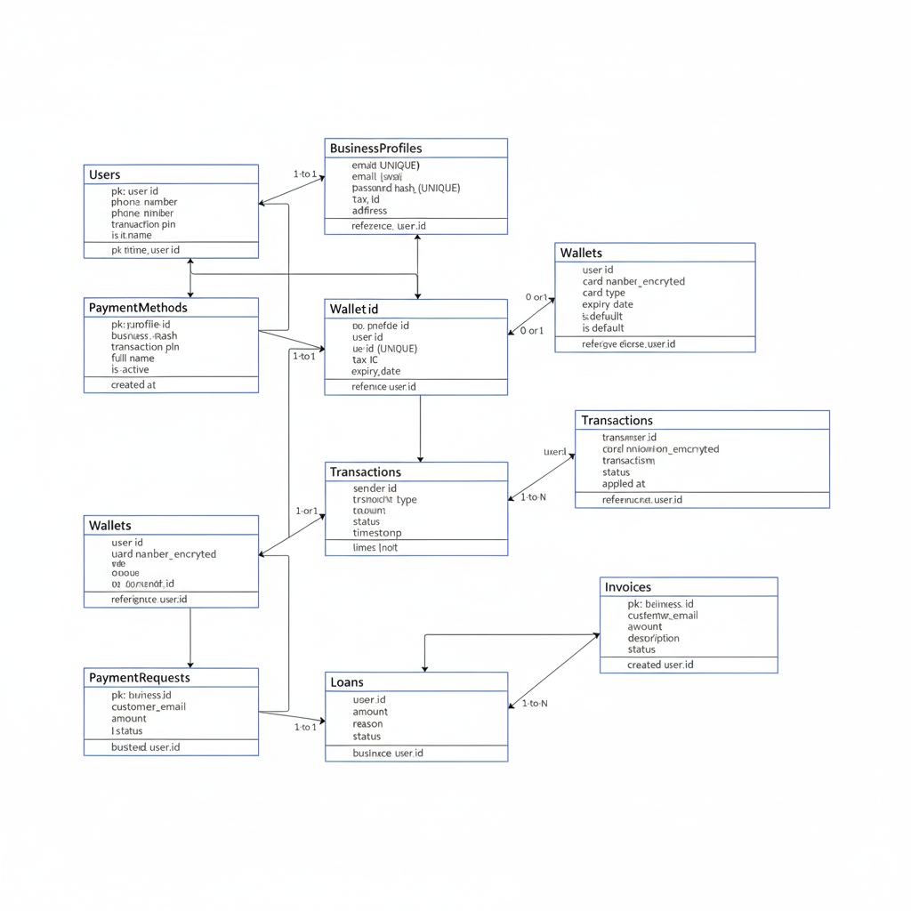

# RevPay – Secure Digital Banking System

## 📌 Project Overview
RevPay is a secure digital banking system developed using Java and Oracle.
It supports both personal and business users with features like wallet
management, money transfers, invoices, and loans.

## 🧱 System Architecture
- Layered Architecture (Presentation, Service, DAO, Database)
- Console-based UI
- Secure transaction handling
- Role-based access (Personal / Business)

## 🗂️ Database ER Diagram
The following ER diagram represents the database design of the RevPay system:

## 📊 Project Presentation
A detailed project presentation explaining the problem statement,
architecture, workflow, security, and future enhancements is available here:

👉 [RevPay – Secure Digital Banking System (PDF)](docs/presentation/KARTHIK_PPT.pptx)

## 🛠️ Technologies Used
- Java (Core Java, JDBC)
- Oracle Database
- Log4j 2
- Maven
- JUnit

## 👨‍💻 Developed By
**Karthik**  
📧 karthik1237t@gmail.com

